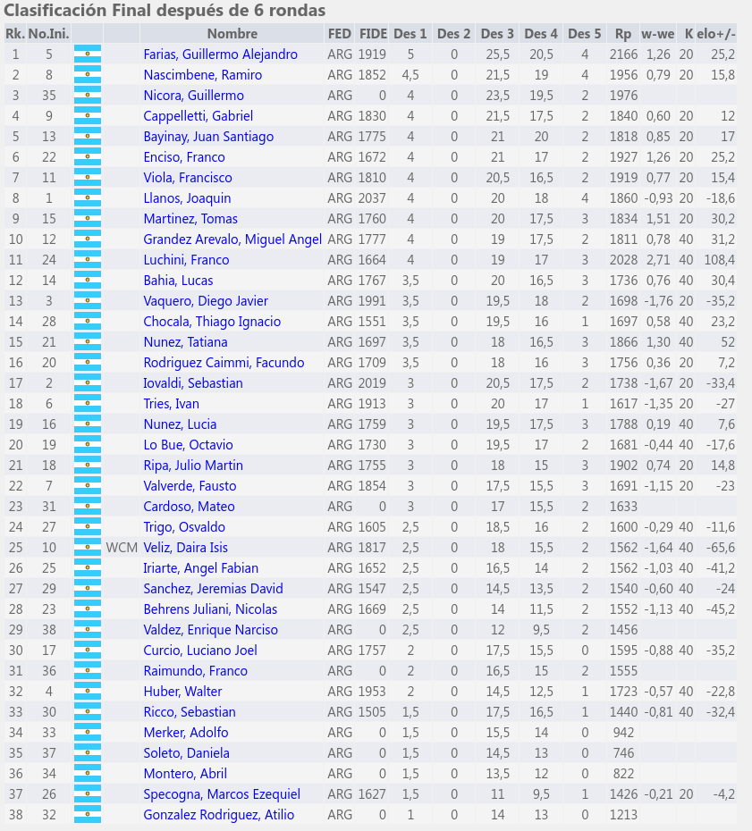
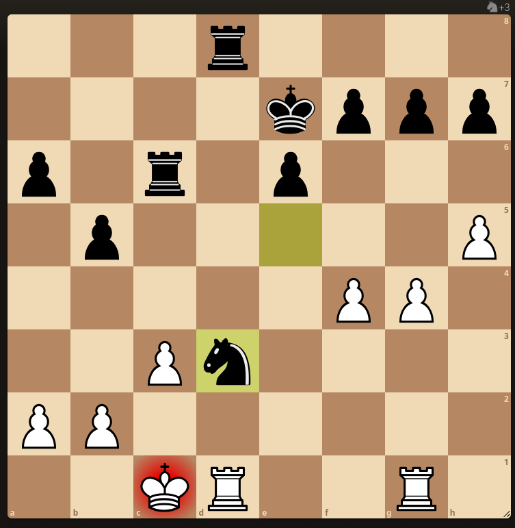
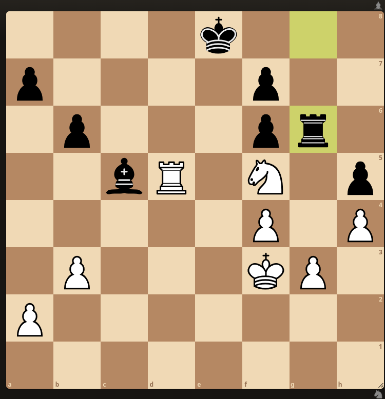
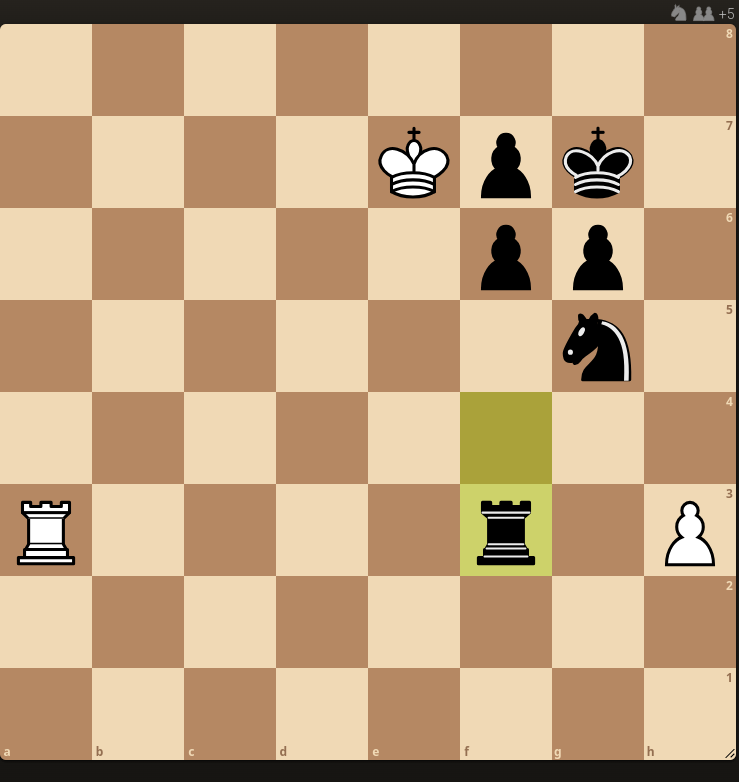
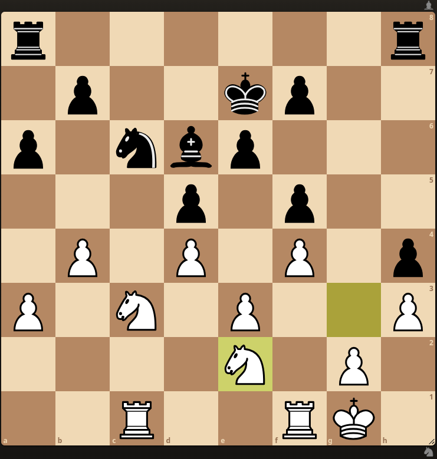

- Mis partidas jugadas en el IRT sub 2400 "Aldo Torrillas". Club de Ajedrez de La Plata 28, 29 y 30 de Marzo 2025

1. Ronda 1: Martinez, Tomás 0-1 Nicora, Guillermo
2. Ronda 2: Nicora, Guillermo 1/2-1/2 Bayinay, Juan Santiago
3. Ronda 3: Bye
4. Ronda 4: Bye
5. Ronda 5: Bahía, Lucas 0-1 Nicora, Guillermo
6. Ronda 6: Nicora, Guillermo 1/2-1/2 Cappelletti, Gabriel
  

- Link: https://chess-results.com/tnr1133646.aspx?lan=2&art=1&rd=6&turdet=YES&flag=30

